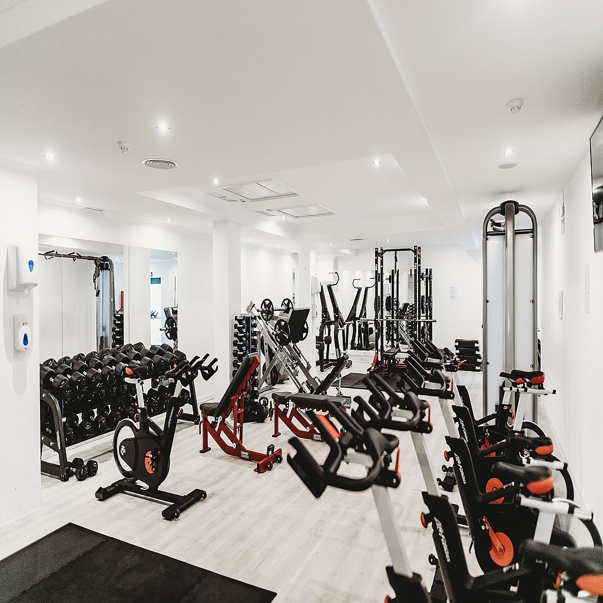
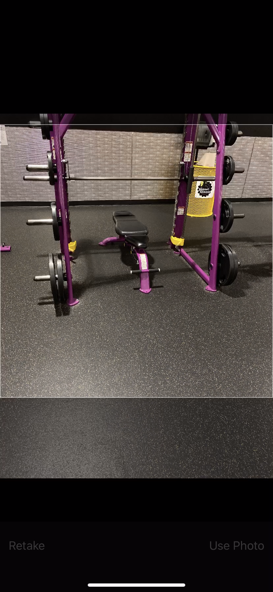
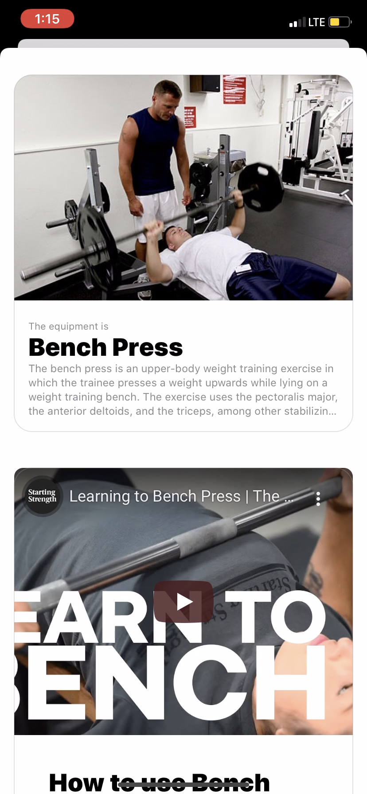
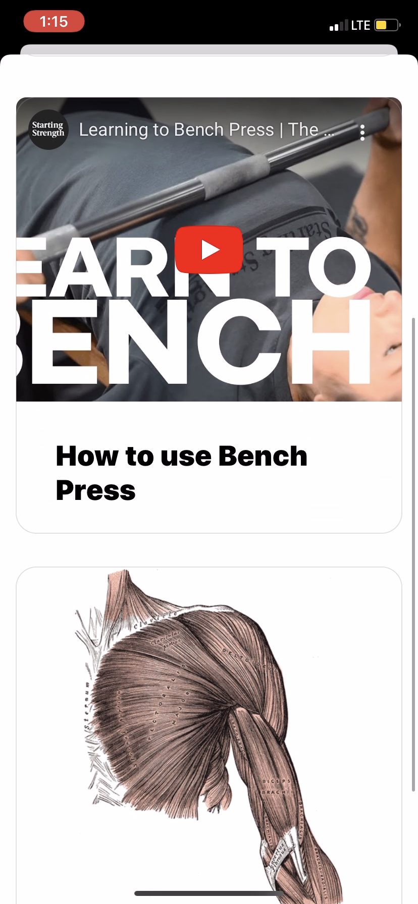

# gymPic

With gymPic you'll be able to take a picture of any gym equipment and using Apple's CoreML machine learning technology gymPic will tell you what equipment it is, give a description along with a how to video on how to use the equipment and will also tell you the major muscle worked.

The link to the app on the iOS app store can be found here: https://apps.apple.com/za/app/gympic/id1530249522

  
  

  
   

  

  
  
  
  

